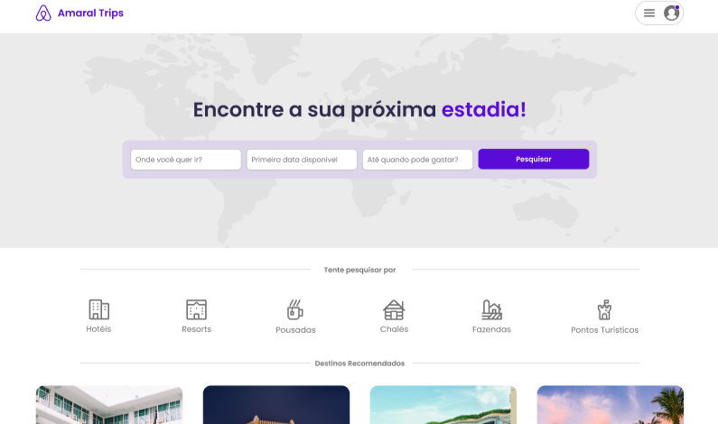

## Amaral | Trips

  

### 🛠️ Nesse projeto foi utilizado

* Next.js - utilizando o poder do Server Components
* NextAuth.js 🔒 com Login pelo Google
* Typescript
* Supabase
* Mobile First
* ORM Prisma
* TailwindCSS
* Stripe (para pagamentos) 💳 junto com WebHooks
* React-hook-form

## 🚧 Layout

## :memo: Licença

Esse projeto está sob a licença MIT. Veja o arquivo [LICENSE](.github/LICENSE) para mais detalhes.

---

Feito com ♥ by JulioAmaral007

&nbsp;